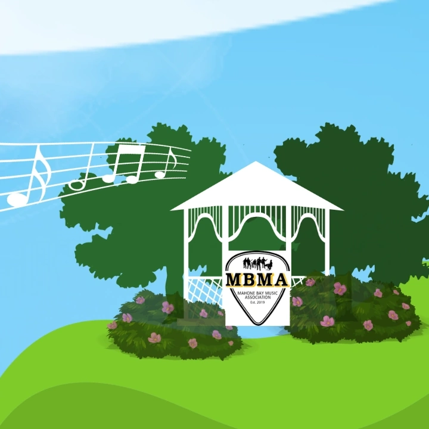

# mahonebaymusic.org

Static website for the Mahone Bay Music Association (MBMA), a non-profit that presents community summer music events in Mahone Bay, Nova Scotia.



## Tech Stack

- Vanilla HTML, CSS, JavaScript (no framework)
- Static asset hosting via `public/`
- Vite (build/dev server)

## Local Development

Install dependencies:

```bash
pnpm install
```

Run local dev server:

```bash
pnpm dev
```

Build production files to `dist/`:

```bash
pnpm build
```

Preview production build locally:

```bash
pnpm preview
```

## Project Structure

- `index.html`: App shell
- `app.js`: SPA routing + page content model
- `styles.css`: Site styling and responsive layout
- `public/assets/`: Images, favicon files, placeholder graphics
- `public/_redirects`: SPA fallback for static hosting
- `public/robots.txt`: Crawling rules
- `public/sitemap.xml`: Route sitemap

## Deployment Notes

- Build command: `pnpm build`
- Output directory: `dist`
- For Cloudflare Pages, deploy from `dist/` and keep `_redirects` so history-mode routes resolve to `index.html`.

